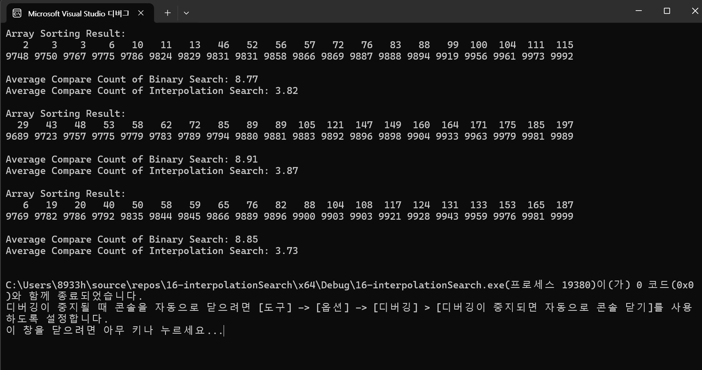

# interpolation Search 가 Binary Search 보다 적게 비교하는 이유를 설명
우선 탐색의 차이가 있다. Binary Search 는 중간값을 기준으로 탐색 범위를 분할하며 정렬하면서 절반씩 줄여가며 탐색을 합니다.
비교 횟수는 (O(log2(N))) 이지만 항상 고정된 범위로 탐색 범위를 나누기 때문에 많은 비교가 발생합니다.
interpolation search 는 정렬된 배열에서 목표값에 상대적 위치를 기반으로 예측합니다. 값이 배열의 시작이나 끝에 가까울 수록
탐색 범위를 빠르게 줄일 수 있습니다. 목표값이 균등하게 분포되어 있으면(배열이) 비교 횟수는 log 보다 더 낮을 수 있습니다.
탐색범위가 빠르게 좁혀지므로 평균 비교 횟수가 줄어듭니다. 최선의 경우일때는 O(log(log(N))) 균등 분포 되어있을때, 최악은 O(N)입니다.
균등 분포될수록 interpolation search 성능이 더 좋아지고 , 정렬된 데이터에서는 값의 분포를 고려해야하므로 Binary search보다 
더 적은 비교로 목표를 찾을 수있습니다.

#Result image

